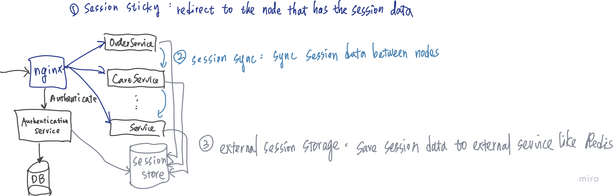
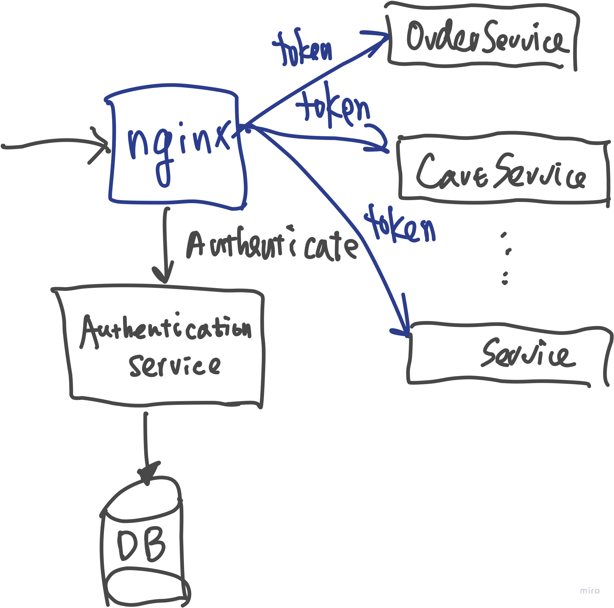
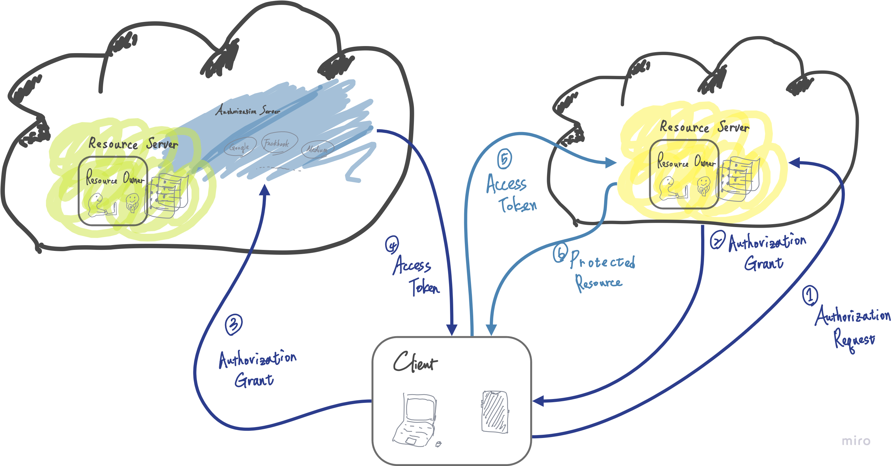

# Security

## Session Management

### Cookie-based

The application server store the authorization user-specific data, and response the session id to
the application client since the browser automatically send the session id with every request.

CSRF (cross site remote forgery) attack

With a distributed system, the session management will be hard to synchronize,although we could make
it
work with session sticky, copy the session to the cluster nodes, or the unified services like redis
to save the user-specific session data.

### Token-based

The authorization user-specific data will store to the token from the authorization server.

Stateless token-based session management

## OAuth 2.0

### Roles

- **🧑‍💻 Resource Owner**

  End-user who can grant access to a protected resource.

- **📱 Client**

  Application requesting access to a protected resource. The client MUST register as a trusted
  client to authorization server.

- **👮‍♂️ Authorization Server**

  Authenticates the resource owner and issues access token after authorization validity.

- **🔐 Resource Server**

  the API that client application want to access.

### Grant types

- **Client Credentials**: grant access if the client credentials is correct, used by
  machine-to-machine applications
- **Password**: grant access while the client credentials is correct AND the user credentials is
  also correct, this grant type used by highly-trusted applications like internal application.
- **Implicit**: authorization server redirect to a page to ask the end user if the client
  application can access their protected resource within some scope, and would issue an access token
  for the destination with fragment (#access_token=...), used by SPA executing on the user's
  browser.
- **Authorization Code**: the authorization mostly like the implicit grant type, but the
  authorization server would redirect to the callback URI registered by the client with the code,
  then the client would request the authorization server for an access token with the code from the
  request parameter at previous step.

### Endpoints

- **Authorization endpoint**
  The `/oauth/authorize` endpoint is used to interact with the resource owner (end-user) and get the
  authorization to access the protected resource, like the implicit or authorization code grant type
  mention above. The authorization request difference between implicit and authorization grant type
  is the value of `response_type`.
  The authorization server needs to know which grant type the application wants to use since the
  server would issue different kind of credentials, for **authorization code** grant, it will issue
  an authorization code which can later be exchanged for an access token at the token endpoint; for
  implicit grant, it will issue an access token and the scope to the application with fragment for
  SPA

  The parameters of the authorize endpoint are:

| Parameter     | Description                                                        |
|---------------|--------------------------------------------------------------------|
| response_type | `token` for implicit grant, `code` for authorization code grant    |
| redirect_uri  | A destination with successful response from authorization endpoint |
| scope         | A list of permissions that the application requires                |
| clientId      | the client identifier that asks for authorization                  |

- **Token endpoint**
  The `/oauth/token` endpoint is used by the application to get an access token or refresh token.
  It's used by all grant except for the implicit grant.

  The parameters of the authorize endpoint for client credentials are:

| Parameter | Description                                                 |
| ------------ |-------------------------------------------------------------|
| grant_type | `client_credentials`                                        |
| clientId | the client identifier that asks for authorization           |
| clientSecret | the secret between the authorization server and the client  |
| scope |                                                             |

    The parameters of the authorize endpoint for password are:

| Parameter    | Description                                                |
|  --------- |------------------------------------------------------------|
| grant_type   | `password`                                                 |
| clientId     | the client identifier that asks for authorization          |
| clientSecret | the secret between the authorization server and the client |
| username     | the credentials of resource owner                          |
| password     | the credentials of resource owner                          |
| scope        |                                                            |

The parameters of the authorize endpoint for authorization code are:

| Parameter    | Description                                                     |
|-------------|-------------------------------------------------------------|
| grant_type   | `authorization_code`                                            |
| clientId     | the client identifier that asks for authorization               |
| clientSecret | the secret between the authorization server and the client      |
| code         | the authorization code from the authorization endpoint response |
| redirect_uri | must be same as the authorization request                       |

The parameters of the authorize endpoint for client credentials are:

| Parameter     | Description                                                |
|  --------- |------------------------------------------------------------|
| grant_type    | `refresh token`                                            |
| clientId      | the client identifier that asks for authorization          |
| clientSecret  | the secret between the authorization server and the client |
| refresh_token | the refresh token from the previous token response         |

